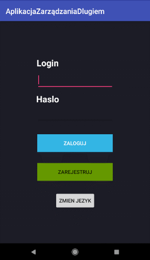

# AplikacjaZarzdzaniaDlugiem
Simple app created with java and azure mobile service. Mobile app manages debt. 

## Screenshots

## Technologies
    
 Programming language: Java version 8 update 201
 Toolkit: Android Studio 3.3.2

## Setup
 Project should be run in the Android version 8.1 (API level 27)

## Features

   User capabilities:

   - sign up to the system
   
   - login up to the system
   
   - display own debt
   
   - add user's debt
   
   - debt summary
   
   - confirmation of debt
  
             

## Status
Project is: finished.

## Inspiration
This app is inspired by Microsoft documentation
(https://docs.microsoft.com/pl-pl/azure/app-service-mobile/app-service-mobile-android-how-to-use-client-library)

## Contact
Created by Michał Respekta (email: michal.respekta@gmail.com ) - feel free to contact me!
